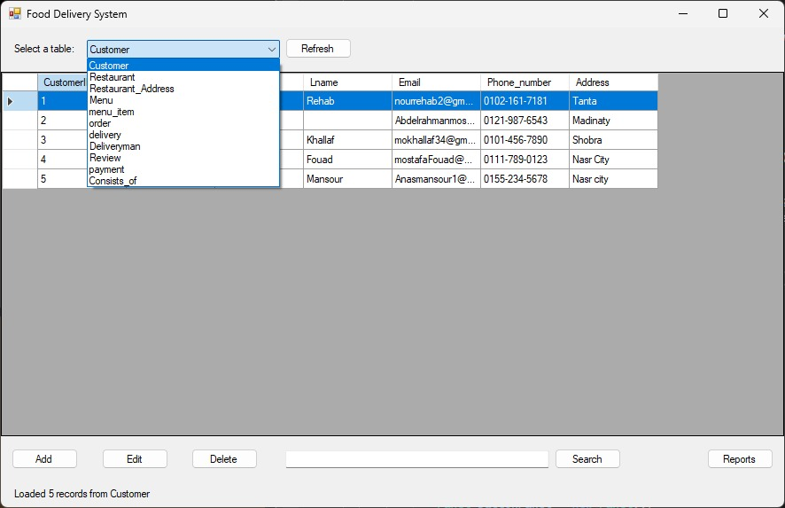

# Restraunt_Management_Database_Application
A Relational database implemented using Microsoft SQL Server with GUI application. Includes full CRUD functionality and generates Customer and Restaurants reports (using SQL functions).

## Features
| Feature                  | Screenshot                                                                 |
|-------------------------|----------------------------------------------------------------------------|
| Create Function         |                     |
| Read Function           |                        |
| Update Function         |                     |
| Delete Function         |                     |
| Generate Reports         |                      |

## Design 

### ERD 
 
### Schema
  
 
